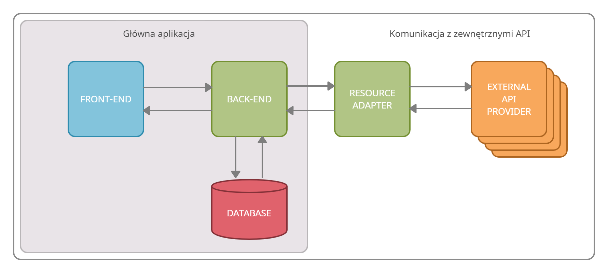
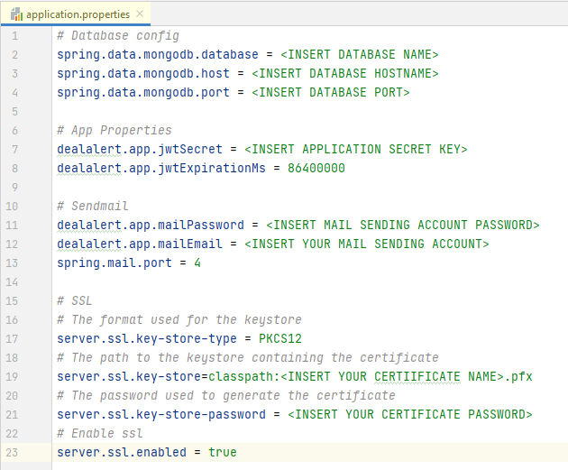
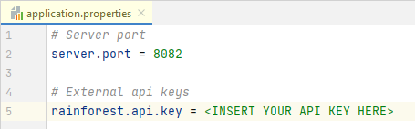

# DealAlert

## Informacje o aplikacji
Aplikacja stworzona do śledzenia zmian cen w sklepach internetowych.
Interfejs użytkownika (front-end) został stworzony za pomocą frameworku Angular. Strona serwerowa (back-end) została zaimplementowana przy użyciu frameworku Spring Boot w języku Java.
## Architektura aplikacji:

## Wykorzystane technologie:
Aby uruchomić aplikację należy posiadać poprawnie zainstalowane poniższe narzędzia:
* Angular CLI: 11.2.9,
* Java 11,
* Apache Maven 3.6.3,
* MongoDB 4.4.1,
* NodeJS 16.9.1.

## Konfiguracja
* należy zdobyć lub wygenerować własne certyfikaty SSL, zainstalować oraz dodać do odpowiednich podkatalogów tj. do podkatalogu DealAlert_frontend/certificates należy dodać
pliki certfikatu o rozszerzeniach .crt i .key, natomiast plik .pfx do podkatalogu DealAlert_backend/resources. Dodatkowo należy wygenerować własny keystore korzystając z narzędzia oferowanego przez Java o nazwie keytool.
Jeżeli pliki certyfikatów nazywają się inaczej niż server.key i server.crt należy edytować zmienne sslKey i ssCert skryptu uruchamiającego serve w odpowiednim miejscu pliku angular.json.
* wygenerować klucz do zewnętrznego API;
* należy utworzyć pliki konfiguracyjne dla adaptera oraz back-endu według przykładów przedstawionych na rysunkach o nazwach application.properties.
Plik konfiguracyjny back-endu należy umieścić w podkatalogu DealAlert_backend/src/main/resources natomiast plik konfiguracyjny adaptera w podkatalogu DealAlert_resource_adapter/src/main/resources.

## Uruchomienie
W celu uruchomienia aplikacji należy uruchomić poszczególne jej moduły oraz przejść na odpowiednią stronę w przeglądarce, przy czym kolejność uruchamiania modułów nie ma znaczenia:
### Baza danych
Aby uruchomić serwer bazy danych należy otworzyć terminal oraz użyć komendy `mongod` lub uruchomić ręcznie plik mongod.exe, dodatkowo należy zaimportować bazę danych z katalogu DealAlert_db lub utworzyć własną o odpowiadającej strukturze
### Back-end
Aby uruchomić back-end należy otworzyć terminal, przenawigować do katalogu o nazwie DealAlert_backend oraz użyć komendy `mvn spring-boot:run`
### Adapter
Aby uruchmić resource_adapter należy otworzyć terminal, przenawigować do katalogu o nazwie DealAlert_resource_adapter oraz użyć komendy `mvn spring-boot:run`
### Front-end
Aby uruchomić front-end należy otworzyć terminal, przenawigować do katalogu o nazwie DealAlert_frontend i użyć polecenia `npm install`, a następnie `ng serve` lub `npm start`.
### Strona
Należy przejść do odpowiednej witryny wpisując w przeglądarkę adres https://localhost:4200
